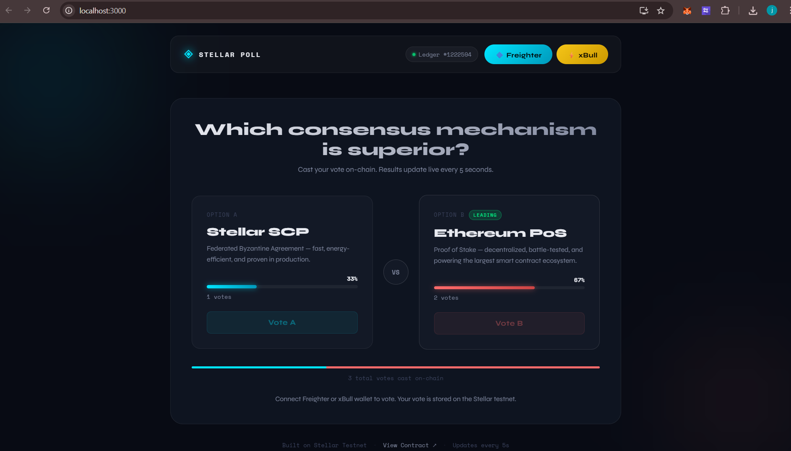

#  Stellar Live Poll

A real-time on-chain polling app built on the Stellar testnet. Users can connect their wallet and vote for one of two options. Results update live every 5 seconds directly from the blockchain.

--

##  Live Demo
https://stellar-live-poll-git-master-janhavilipare17s-projects.vercel.app

--

##  Screenshots

### Frontend


### Freighter Wallet Connection


### Freighter Signature Request


### Freighter Results


### xBull Wallet Connection


### xBull Results


---

##  Features

-  Multi-wallet support — Freighter and xBull
-  Smart contract deployed on Stellar testnet
-  Real-time vote results (updates every 5 seconds)
-  Transaction status tracking (Pending → Confirmed)
-  3 error types handled (wallet not found, rejected, insufficient balance)
-  Live ledger number display
-  View transactions on Stellar Explorer

---

##  Contract Details

- **Deployed Contract Address:**  
  `CC7IYQYSM76SN7EP3QYPYPKZZ4MST6G6CP4AIIM6TNNMUIZRKIHOQX3I`

- **Network:** Stellar Testnet

- **View on Explorer:**  
  [View Contract](https://stellar.expert/explorer/testnet/contract/CC7IYQYSM76SN7EP3QYPYPKZZ4MST6G6CP4AIIM6TNNMUIZRKIHOQX3I)

---

##  Transaction Hash

A verified contract call (vote) on Stellar testnet:

```
786ec0cfeb5b6cd325546f9591bea959466c37b998ec515e4d29d5a58c90b86a
```

[View on Stellar Explorer](https://stellar.expert/explorer/testnet/tx/786ec0cfeb5b6cd325546f9591bea959466c37b998ec515e4d29d5a58c90b86a)

---

##  Setup Instructions

### Prerequisites

- Node.js v18+
- [Freighter Wallet](https://www.freighter.app/) browser extension
- [xBull Wallet](https://xbull.app/) browser extension (optional)
- Stellar CLI

### 1. Clone the repository

```bash
git clone https://github.com/janhavilipare17/Stellar-Live-Poll.git
cd Stellar-Live-Poll
```

### 2. Install dependencies

```bash
npm install
```

### 3. Start the app

```bash
npm start
```

The app will open at `http://localhost:3000`

### 4. Connect your wallet

- Open **Freighter** or **xBull** extension
- Switch network to **Testnet**
- Fund your address via [Friendbot](https://friendbot.stellar.org/?addr=YOUR_ADDRESS)
- Click  Freighter or  xBull button in the app

### 5. Vote

- Click **Vote A** (Stellar SCP) or **Vote B** (Ethereum PoS)
- Approve the transaction in your wallet
- Watch the results update in real time!

---

##  Smart Contract

The contract is written in Rust using the Soroban SDK.

### Functions

| Function | Description |
|---|---|
| `vote_a()` | Cast a vote for Option A |
| `vote_b()` | Cast a vote for Option B |
| `get_results()` | Returns `(u32, u32)` — votes for A and B |

### Deploy your own

```bash
cargo build --target wasm32-unknown-unknown --release

stellar contract deploy \
  --wasm target/wasm32-unknown-unknown/release/live_poll.wasm \
  --source alice \
  --network testnet
```

---

##  Error Handling

The app handles these error types:

1. **Wallet Not Found** — Freighter or xBull not installed
2. **Transaction Rejected** — User declined to sign
3. **Insufficient Balance** — Account not funded on testnet

---

##  Tech Stack

- React 19
- Stellar SDK (`@stellar/stellar-sdk`)
- Freighter API (`@stellar/freighter-api`)
- Soroban Smart Contracts (Rust)
- Stellar Testnet RPC

---

##  Project Structure

```
stellar-live-poll/
├── src/
│   ├── App.js          # Main React app
│   ├── App.css         # Styles
│   ├── index.js
│   └── index.css
├── contract/
│   ├── src/
│   │   └── lib.rs      # Soroban smart contract
│   └── Cargo.toml
├── screenshots/
│   ├── frontend.png
│   ├── freighter connect.png
│   ├── freighter result.png
│   ├── freighter signature.png
│   ├── xBull connect.png
│   └── xBull result.png
├── public/
├── package.json
└── README.md
```

---

Built for **Stellar Internship Level 2** — Multi-wallet app with deployed contract and real-time event integration.
